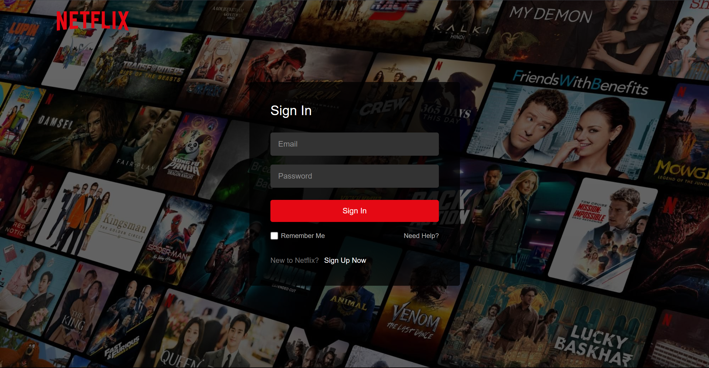
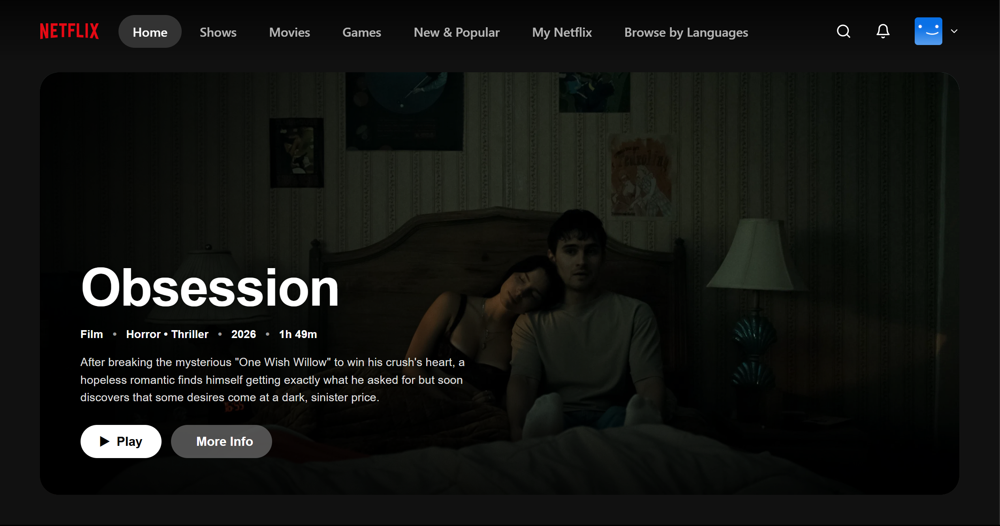
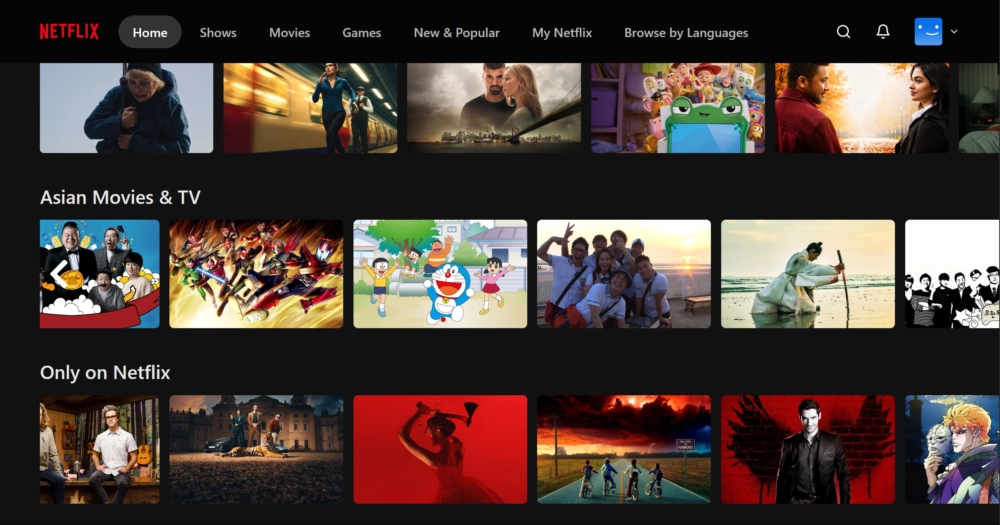
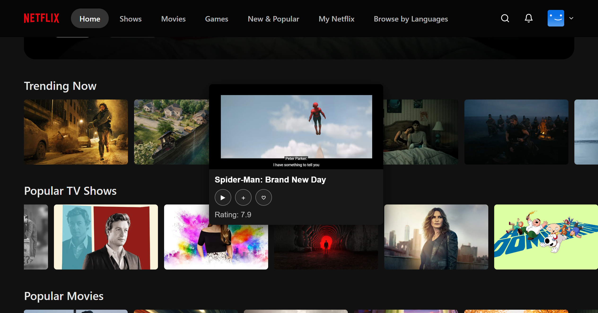
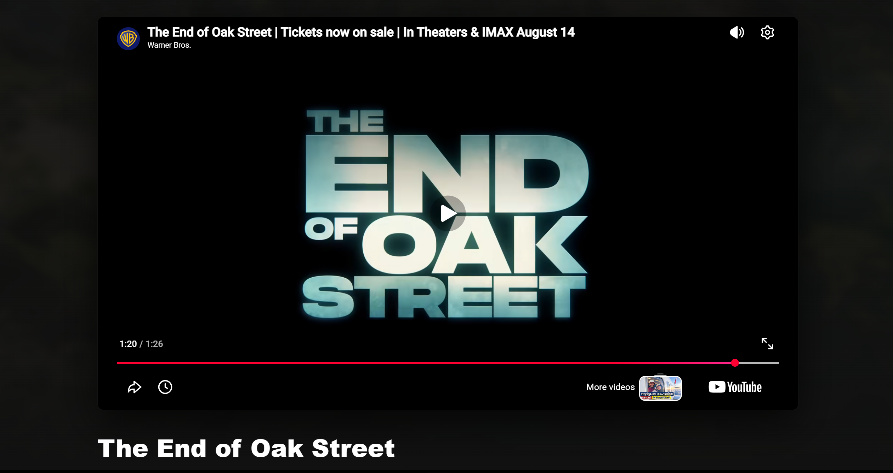

# 🎬 Netflix Clone 2026

A Netflix-inspired streaming experience built from scratch with React and TypeScript.

<h2 align="center">📸 Screenshots</h2>

  
  

  
  

  

## ✨ Features

- 🔐 Firebase Authentication
- 🎬 Movie & TV Shows
- 🎥 Trailer & Preview
- 🌏 Asian Movies & TV
- 🔴 Only on Netflix
- 🛡️ Protected Routes
- 📱 Responsive Design
- ⚡ TMDB API Integration

## 🛠️ Tech Stack

- React
- TypeScript
- CSS

---

